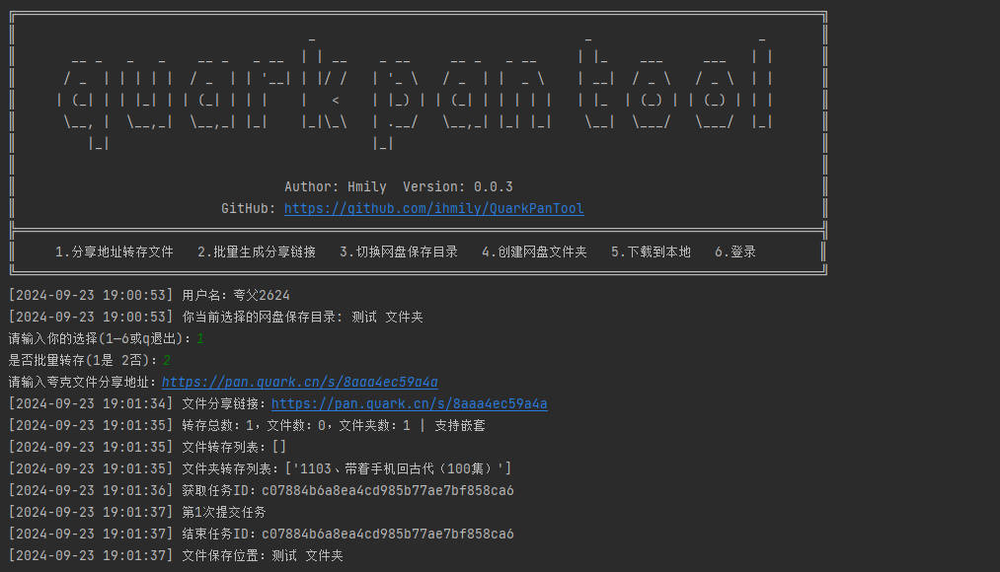

# QuarkPanTool

[](https://www.python.org/downloads/release/python-3116/)
[](https://github.com/ihmily/QuarkPanTool/releases/latest)
[](https://github.com/ihmily/QuarkPanTool/releases/latest)


QuarkPanTool 是一个简单易用的小工具，旨在帮助用户快速批量转存分享文件、批量生成分享链接和批量下载夸克网盘文件。

## 功能特点

- 运行稳定：基于playwright支持网页登录夸克网盘，无需手动获取Cookie。
- 轻松操作：简洁直观的命令行界面，方便快捷地完成文件转存。
- 批量转存：支持一次性转存多个夸克网盘分享链接中的文件。
- 批量分享：支持一次性将某个文件夹内的所有文件夹批量生成分享链接，无需手动分享文件。
- 本地下载：支持批量下载网盘文件夹中的所有文件。

## 如何使用

如果不想自己部署环境，可以下载打包好的可执行文件(exe)压缩包 [QuarkPanTool](https://github.com/ihmily/QuarkPanTool/releases) ，解压后直接运行即可。

1.下载代码

```
git clone https://github.com/ihmily/QuarkPanTool.git
```

2.安装依赖

```
pip install -r requirements.txt
playwright install firefox
```

3.运行

```
python quark.py
```

运行后会使用playwright进行登录操作，当然也可以自己手动获取cookie填写到config/cookies.txt文件中。

## 注意事项

- 首次运行会比较缓慢，请注意底部任务栏，程序会自动打开一个浏览器，让你登录夸克网盘，登录完成后，请不要手动关闭浏览器，回到软件界面按Enter键，浏览器会自动关闭并保存你的登录信息，下次运行就不需要登录了。（如果是Linux环境，请自行在网页获取Cookie后填入config/cookies.txt文件使用）

- 执行批量转存之前，请先在url.txt文件中填写网盘分享地址（一行一个）

- 执行批量分享文件夹，我们需要使用的是上两级文件夹内页面的地址，如要分享文件夹B下的所有文件夹

  ```
  /文件夹A/文件夹B/文件夹1
  /文件夹A/文件夹B/文件夹2
  ```
  
此时我们需要输入的页面地址就是文件夹A内的页面地址。

## 效果演示



## 许可证

QuarkPanTool 使用 [Apache-2.0 license](https://github.com/ihmily/QuarkPanTool#Apache-2.0-1-ov-file) 许可证，详情请参阅 LICENSE 文件。

------

**免责声明**：本工具仅供学习和研究使用，请勿用于非法目的。由使用本工具引起的任何法律责任，与本工具作者无关。
