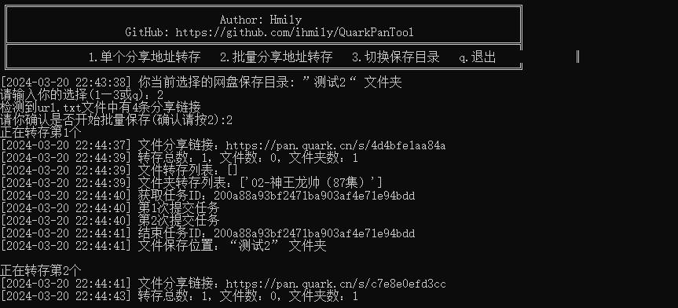

# QuarkPanTool

QuarkPanTool 是一个简单易用的小工具，旨在帮助用户快速批量转存夸克网盘分享文件。它提供了一种简便的方式，让您能够轻松地将夸克网盘中的共享文件保存到您的个人账户中。

## 功能特点

- 运行稳定：基于playwright支持网页登录夸克网盘，Cookie持久化保存。
- 轻松操作：简洁直观的命令行界面，方便快捷地完成文件转存。
- 批量转存：支持一次性转存多个夸克网盘分享链接中的文件。

## 如何使用

1.下载代码

```
git clone https://github.com/ihmily/QuarkPanTool.git
```

2.安装依赖

```
pip install -r requirements.txt
playwright install firefox
```

3.运行

```
python quark.py
```

如果不想自己部署环境，可以直接下载打包好的可执行文件压缩包 [QuarkPanTool](https://github.com/ihmily/DouyinLiveRecorder/releases) 运行。

## 注意事项

- 首次运行会比较缓慢，请注意底部任务栏，程序会自动打开一个浏览器，让你登录夸克网盘，登录完成后，请不要手动关闭浏览器，回到软件界面按Enter键，浏览器会自动关闭并保存你的登录信息，下次运行就不需要登录了。
- 接着会提示让你输入保存位置的文件夹ID，如果你不知道ID请直接按回车键，或者输入0，
  0代表将你的文件保存在网盘根目录。

## 效果演示



## 许可证

QuarkPanTool 使用 [Apache-2.0 license](https://github.com/ihmily/QuarkPanTool#Apache-2.0-1-ov-file) 许可证，详情请参阅 LICENSE 文件。

------

**免责声明**：本工具仅供学习和研究使用，请勿用于非法目的。由使用本工具引起的任何法律责任，与本工具作者无关。
